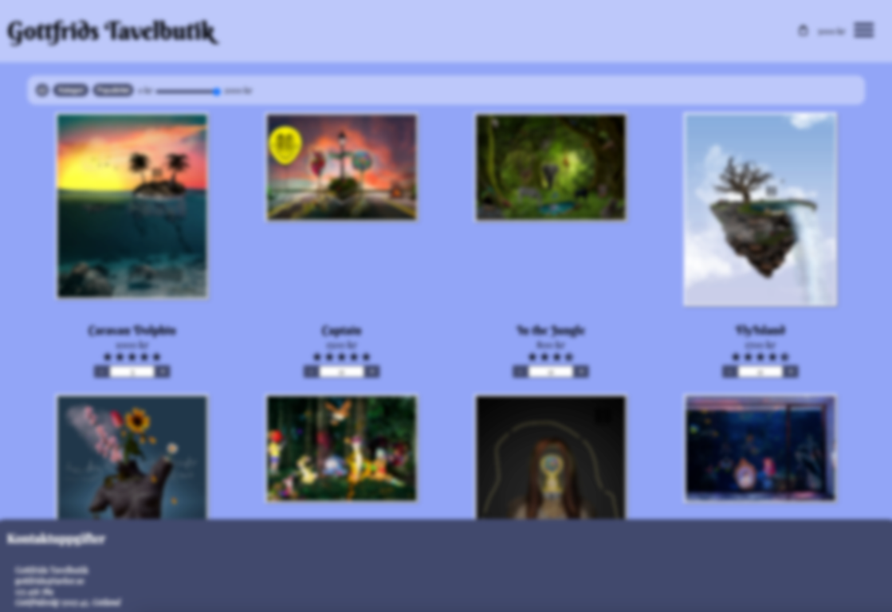
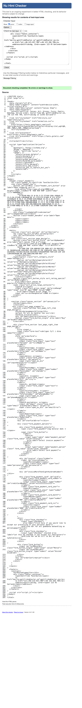
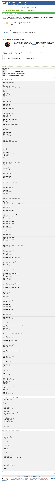
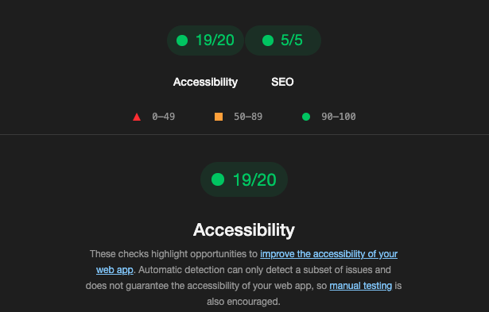

# Gottfrids Tavelbutik

This project was developed as a school project at Medieinstitutet. 

The aim was to create a webshop for donuts or another product of choice. 
I chose to create a webshop for Canvases I've created in photoshop a few years ago to make it a little bit more personal. 

Troughtout this project I focused on understanding the basics of Java Script and I'm excited to redo this projects in a few years. This is my first project so I consider it to be the most important one. I hope you enjoy. 

## Achievments that was required for this assigment

* One page 
* Responsive design (mobile, tablet & desktop version)
* Complete a order by using the keyboard only (a11y)
* Increase & decrease amount of products to order
* Products is hardcoded (no API, database, JSON file)
* Sort products by name, price, category and rating
* Cart summery
* Special price rules depending on the current date or total order sum. 
* Form whith disabled sumbit button until details are valid.
* Confirmation when ordered products

## Live published site

[Click here for live published version](https://medieinstitutet.github.io/fed24d-js-intro-inl-1-webshop-mikaelakihl/)

**Language: Swedish**

## Sneak peak

## Tech Stack

**HTML** | **JavaScript** | **SCSS** | **Prettier** 

## Color Reference

| Color             | Hex                                                                |
| ----------------- | ------------------------------------------------------------------ |
| Primary Color |  #92a5f7 |
| Secondary Color |  #41496e |
| White Color |  #ffffff |
| Transparent Color |  #ffffff61 |

## Lessons Learned

Since this was my first project I've learned some lessons of the basics in JavaScript. 

* Keep good structure
* It matter where you write the code
* It's better to use global variables 
* Write psuedocode before you start to code

Writing pseudocode was difficult for me since everything was a new experience, but for the next project I think it will be very helpful.
## Validation & a11y

### HTML

### CSS 

### Lighthouse Analyze

